# MediCareAI Web App

## Overview

MediCareAI is a web application designed to enhance healthcare services using artificial intelligence. This repository contains the frontend portion of the application, built using **ReactJS**. The backend is developed using **ExpressJS**, and the AI model is served through a **Flask** server, utilizing a Random Forest model. This project is part of our NT208.O21.ANTN class.
## Team Members
- 22520183 - Trần Dương Minh Đại
- 22521208 - Cao Quí

## Table of Contents
- [MediCareAI Web App](#medicareai-web-app)
  - [Overview](#overview)
  - [Team Members](#team-members)
  - [Table of Contents](#table-of-contents)
  - [Setup Environment](#setup-environment)
    - [Prerequisites](#prerequisites)
    - [Installation](#installation)
  - [Dependencies](#dependencies)
  - [Features](#features)
    - [Basic Features](#basic-features)
    - [Advanced Features](#advanced-features)
  - [Deployment](#deployment)
    - [Firebase Hosting](#firebase-hosting)
  - [Screenshots and Scoring Criteria](#screenshots-and-scoring-criteria)
    - [Basic Features](#basic-features-1)
    - [Advanced Features](#advanced-features-1)
    - [Bonus Scoring Criteria](#bonus-scoring-criteria)


## Setup Environment

### Prerequisites

Ensure you have the following installed on your system:
- Node.js and npm

### Installation
**Note: You must clone the backend and model repository and follow the instructions in these repository:**
   - Backend 
   ```bash
    git clone https://github.com/tdmidas/MediCareAI-Model.git
  ```

  - Flask server for running AI models
   ```bash
    git clone https://github.com/tdmidas/MediCareAI-Model.git
   ```

1. **Clone the frontend repository:**
    ```bash
    git clone https://github.com/tdmidas/MediCareAI-frontend.git
    ```

2. **Install dependencies:**
    ```bash
    npm install
    ```

3. **Start the development server:**
    ```bash
    npm start
    ```

## Dependencies
- antd
- @mui
- date-fns: 3.6.0
- dayjs: 1.11.10
- dotenv: 16.4.5
- firebase: 10.9.0
- markdown-it: 14.1.0
- react: 18.2.0
- react-content-loader: 7.0.0
- react-credit-cards-2: 1.0.2
- react-dom: 18.2.0
- react-icons: 5.0.1
- react-markdown: 9.0.1
- react-markdown-editor-lite: 1.3.4
- react-responsive: 10.0.0
- react-router-dom: 6.22.3
- react-scripts: 5.0.1
- react-speech-recognition: 3.10.0
- react-toastify: 10.0.5
- react-webcam: 7.2.0
- slug: 9.0.0
- slugify: 1.6.6

## Features

### Basic Features
- Login, signup with Google, Facebook, Email and password
- Account management such as change avatar, bio, name, password,..
- Basic health record keeping (BMI, Blood Pressure, Blood Sugar, Cholesterol)
- Health notification
- View doctors and rating a doctor.
- View health blog post also like and comment on that post.
- Write blog post (tagging, images,...)


### Advanced Features
- AI-based health diagnostics 
- Health AI Chatbot intergration and health recommendation
- Generating blog post with prompt
- Real-time health monitoring 
- Booking, managing and paying  doctor appointments


## Deployment

### Firebase Hosting

- You can use any cloud provider or web hosting to deploy this repository

## Screenshots and Scoring Criteria

### Basic Features
 **Login**:
 
 **Signup**: 
  
**Login with Facebook**
  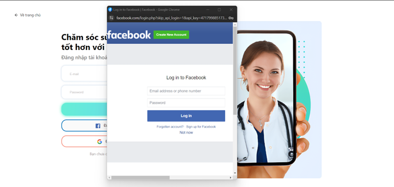
**Login with Google**
  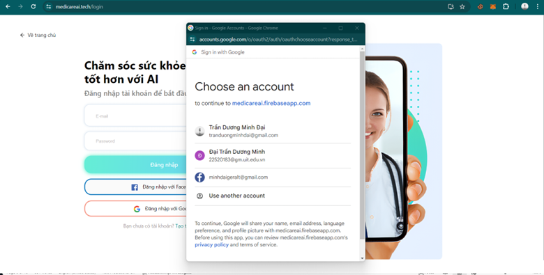
 **Account Settings**: 
  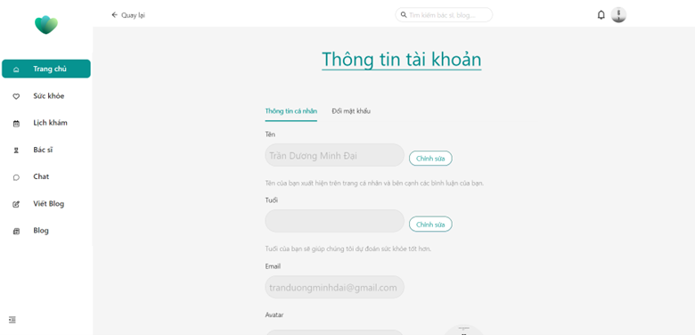
  **Change password**: 
  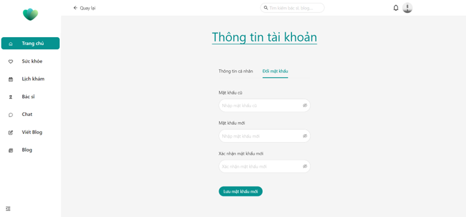
 **Health Records (BMI, Blood Pressure, Blood Sugar, Cholesterol)**: 
 - BMI
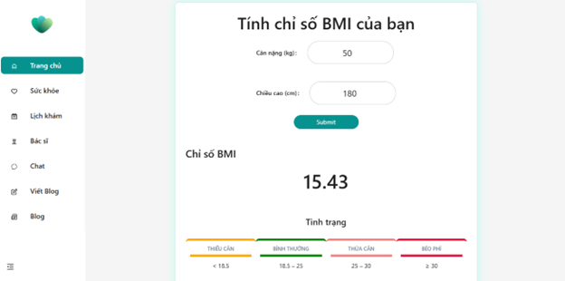
 - Blood Sugar
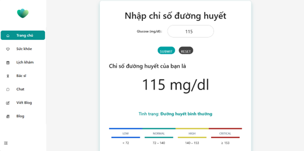

 - Blood Pressure
  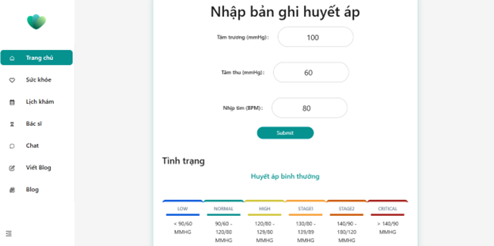

 - Cholesterol
    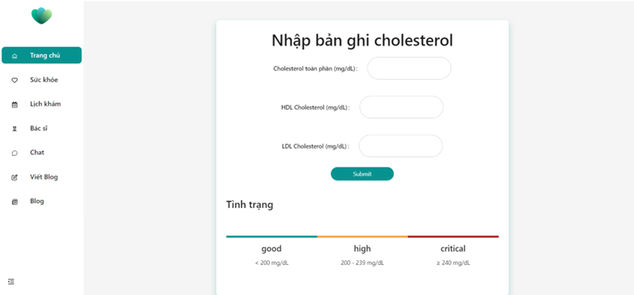

 **Health Notification**: 
    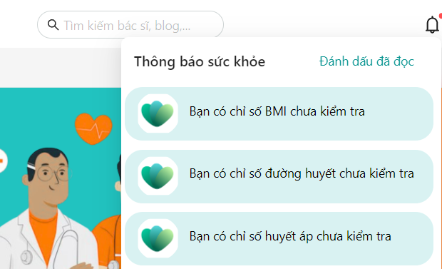

 **View Doctors and Rate a Doctor**:
 - View doctors 
  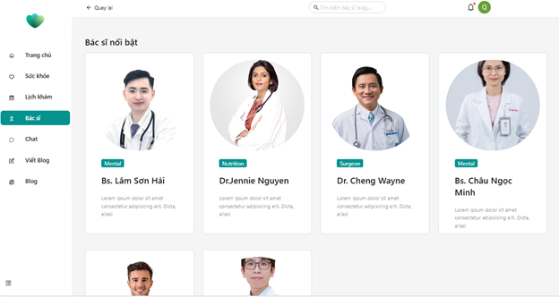
  - Doctor's detail
     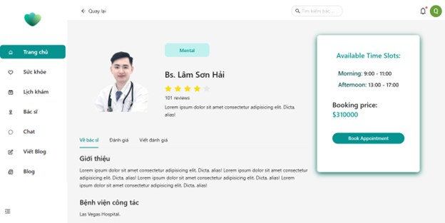

- Rate a doctor
  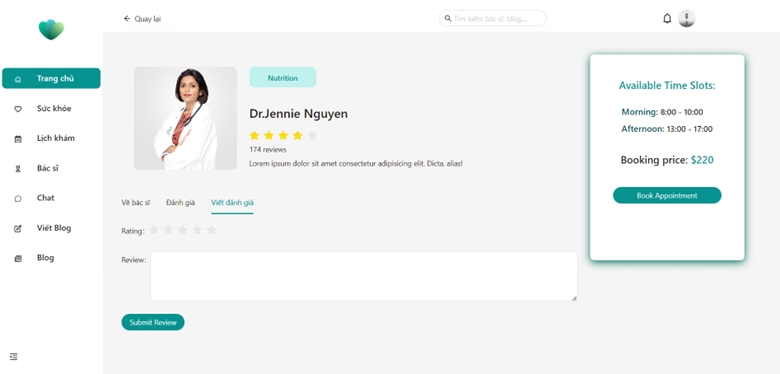
  - View doctor's rating
  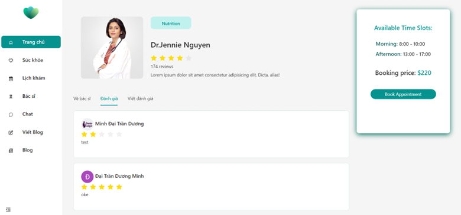

 **View and Interact with Blog Posts**
 - View blog
     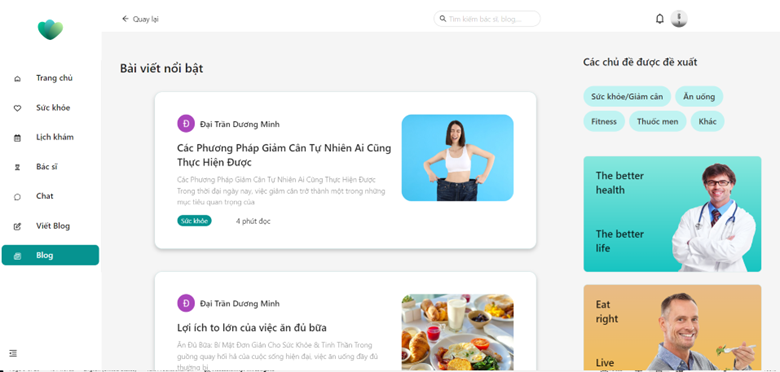
 - Read blog
   
- Write blog and tagging
     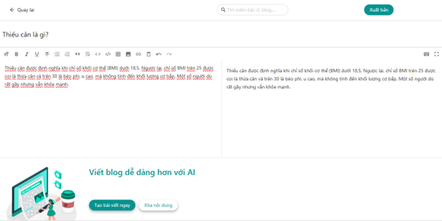
   

 - Like and comment
     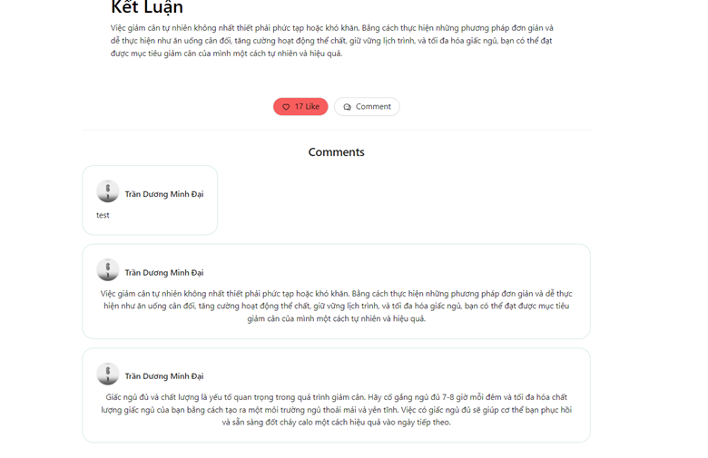

**Search doctor and blog posts**
   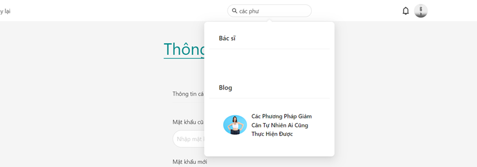


### Advanced Features
**AI-based Health Diagnostics and Monitoring**
   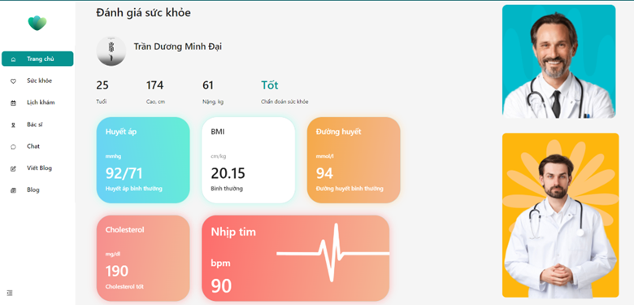

**Health AI Chatbot Integration**
- View
   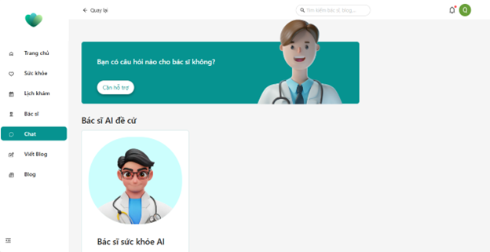
- Interacting
     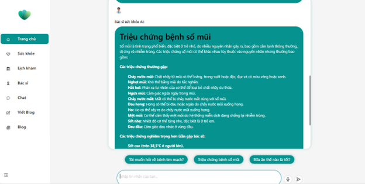


**Generate Blog Post with Prompt**
   

**Booking, Managing, and Paying for Doctor Appointments**
- Booking
     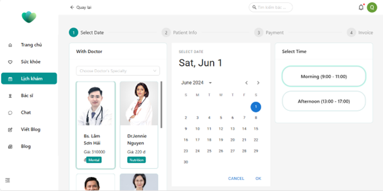
- Infomation
        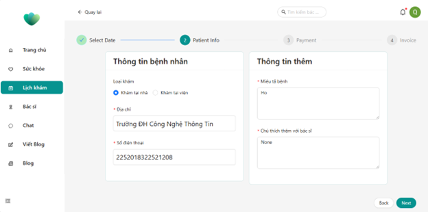


- Paying
     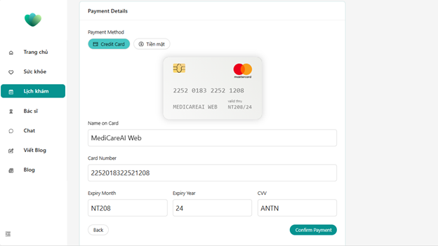
- Invoice 
   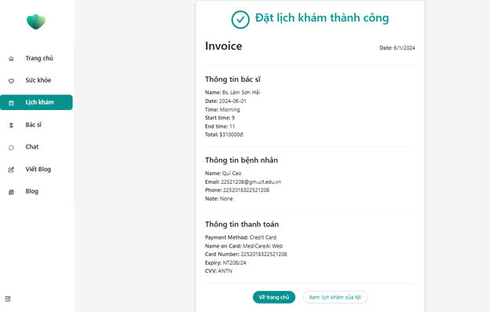

- Management
   

  
### Bonus Scoring Criteria
**Deployment**
- Frontend
   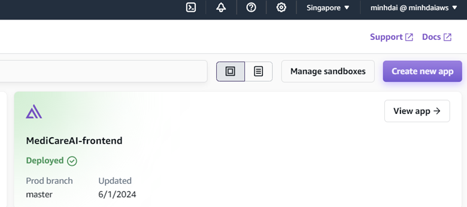
- Backend
   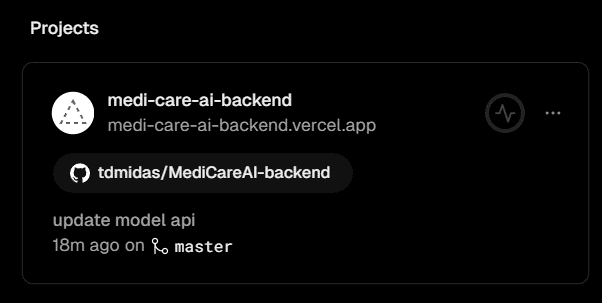
**Performance**
- Google Page Speed (Desktop)
   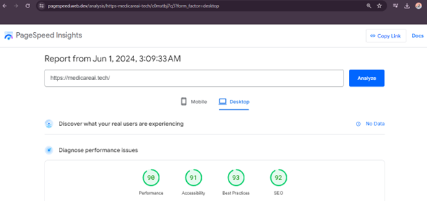

- Google Page Speed (Mobile)
     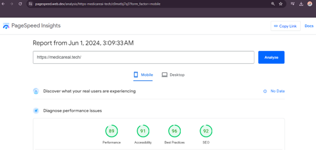

**Seminar**
   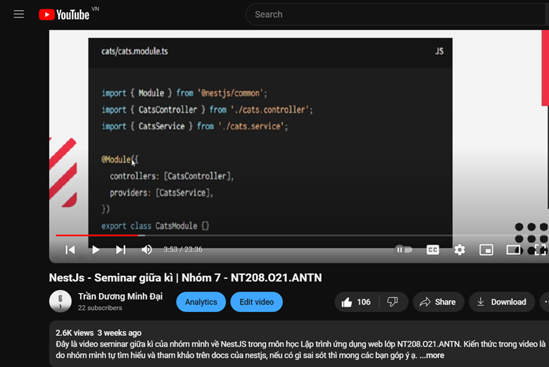

**SEO**
   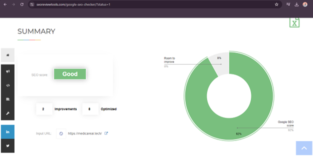

**Google index**
   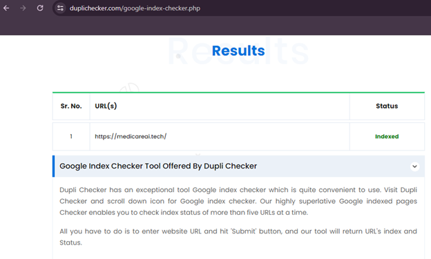


