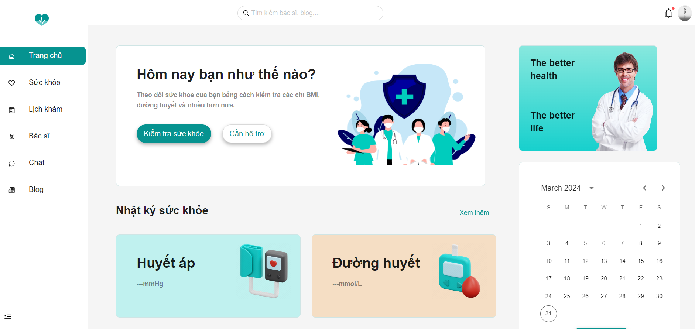

# NT208.O21.ANTN Project - Group-7
## MediCareAI Web app 

MediCareAI is a web application designed for user to manage their health and book an appointment with doctors their want.  
### Technologies Used

- **ReactJS** JavaScript library for building user interfaces.
- **AntDesign**  UI library for ReactJS.
- **ExpressJS** for backend (working on it..),
- **MongoDB** document database
- **AWS Cloudfront** for CDN and **AWS EC2** for deploying(hope so..)
- **Firebase** for Google Authentication

## Main Features of the Website

1. **Login and Register Authentication**: Utilizes Firebase Authentication for logging in and registering with Google.

2. **Health Information Management**: Provides functionalities to manage and detect their health problem.
- **Heart rate monitoring**  through the camera using zero-crossing detection (based on light passing through your fingertip).
- **Blood pressure**, **Sugar blood** and **BMI** value take from user input  
  
=> Synthesize all health information to evaluate the user's health status.

3. **Integrated Health Chatbot**: Offers various health chatbots fine-tuned on different health field datasets to help patients better understand their health conditions and receive advice.
4. **Appointment Doctor**: Users can schedule appointments with doctors based on their availability and specialization.
5. **Medical Blog Sharing**: Read helpful health blogs and able to comment on it.

## Installation and Running the Application

1. **Clone repository**: Clone the repository from GitHub:
```
git clone https://github.com/your/repository.git
```


2. **Install dependencies**: Navigate to the directory containing the source code and install the dependencies:

```
cd MediCareAI
npm install
```

3. **Configure Firebase**: Create a project on Firebase and provide configuration information in the `.env` file.

4. **Run the application**: Use the following command to start the application:
```
npm start
```

### Home screenshot

### Logged in

### Blog screenshot

### Read Blog screenshot

### Doctor


### Login required

### Login

### Signup


